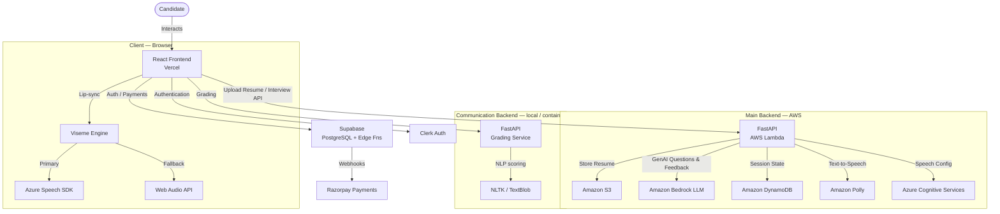

# GBAR Made Easy — Harry The Blaze

[](https://www.harrytheblaze.site/)
[](https://reactjs.org/)
[](https://www.typescriptlang.org/)
[](https://www.python.org/)
[](https://aws.amazon.com/)

> A full-stack platform that helps candidates prepare for enterprise recruitment assessments (GBARs) by replicating real-world cognitive games, communication rounds, and AI-powered mock interviews.

---

## 📋 Table of Contents

- [About the Project](#-about-the-project)
- [Key Features](#-key-features)
- [System Architecture](#-system-architecture)
- [Project Structure](#-project-structure)
- [Tech Stack](#-tech-stack)
- [Prerequisites](#-prerequisites)
- [Environment Variables](#-environment-variables)
- [Getting Started](#-getting-started)
  - [1. Frontend](#1-frontend-react--typescript)
  - [2. Main Backend (FastAPI + AWS Lambda)](#2-main-backend-fastapi--aws-lambda)
  - [3. Communication Backend (FastAPI — local grading)](#3-communication-backend-fastapi--local-grading)
  - [4. Supabase (Database & Auth)](#4-supabase-database--auth)
- [Deployment](#-deployment)
- [Engineering Decisions](#-engineering-decisions)
- [Contributing](#-contributing)
- [Contact](#-contact)

---

## 🚀 About the Project

**GBAR Made Easy** (branded as *Harry The Blaze*) is a full-stack educational platform designed to help students prepare for high-pressure enterprise recruitment assessments such as Accenture's GBAR.

Unlike standard quiz apps, this platform focuses on **psychological conditioning** by replicating the exact UI/UX, time constraints, and cognitive load of real assessments — including game-based rounds, communication rounds, and AI-driven mock interviews with resume analysis.

---

## ✨ Key Features

| Feature | Description |
|---------|-------------|
| 🎮 **Cognitive Games** | Balloon Math (physics, `requestAnimationFrame`) and Matrix Flow (DFS pathfinding) mirror GBAR game-based rounds. |
| 🎤 **Communication Round** | Speech-to-text responses graded locally by fuzzy-match / NLP scoring (`fuzzywuzzy`, `textblob`). |
| 🤖 **AI Mock Interview** | AWS Bedrock-powered interviewer generates questions from an uploaded resume (PDF), conducts a spoken interview using Amazon Polly TTS + Azure Speech SDK visemes, and returns AI feedback. |
| 📄 **Resume Analysis** | Uploaded resumes are parsed (PyPDF) and stored in S3; Bedrock LLM derives personalised interview questions. |
| 🔐 **Authentication** | Clerk magic-link email authentication with protected dashboard routes. |
| 💳 **Premium Subscriptions** | Razorpay payment processing via Supabase Edge Functions for secure server-side handling. |
| 🏆 **Placed Guru** | Community success stories and guidance from students who cracked placement rounds. |

---

## 🏗️ System Architecture



---

## 📂 Project Structure

```
gbar_made_easy/
├── src/                          # React + TypeScript frontend
│   ├── components/               # Reusable UI components (Shadcn / Radix UI)
│   ├── pages/                    # Route-level pages
│   │   ├── Accenture.tsx         # GBAR practice hub
│   │   ├── BalloonMath.tsx       # Cognitive game — Balloon Math
│   │   ├── HiddenMaze.tsx        # Cognitive game — Matrix Flow
│   │   ├── AIInterview.tsx       # AI mock interview
│   │   ├── Dashboard.tsx         # User dashboard
│   │   └── ...
│   ├── hooks/                    # Custom React hooks
│   ├── lib/                      # Utility helpers
│   └── integrations/             # Supabase client & types
│
├── backend/                      # Main FastAPI backend (deployed to AWS Lambda)
│   ├── main.py                   # App entry point + Mangum Lambda handler
│   ├── routers/
│   │   ├── interview.py          # AI interview endpoints
│   │   ├── resume.py             # Resume upload & analysis
│   │   ├── game.py               # Game data endpoints
│   │   └── misc.py               # Utility endpoints
│   ├── services/
│   │   ├── bedrock_analysis.py   # AWS Bedrock LLM calls
│   │   ├── azure_speech.py       # Azure TTS / viseme service
│   │   └── aws_utils.py          # S3 / Polly / DynamoDB helpers
│   ├── schemas.py                # Pydantic request/response models
│   └── requirements.txt
│
├── communication-backend/        # Standalone grading service (local / Docker)
│   ├── main.py                   # FastAPI app
│   ├── grading.py                # NLP scoring logic
│   ├── data.py                   # Question bank
│   └── requirements.txt
│
├── supabase/
│   ├── migrations/               # PostgreSQL schema migrations
│   └── functions/                # Edge Functions (Razorpay webhooks)
│
├── template.yaml                 # AWS SAM template (Lambda + DynamoDB + S3)
├── deploy.sh                     # SAM deployment helper script
├── package.json                  # Frontend dependencies
├── vite.config.ts
└── tailwind.config.ts
```

---

## 🛠️ Tech Stack

| Layer | Technologies |
|-------|-------------|
| **Frontend** | React 18, TypeScript, Vite, Tailwind CSS, Shadcn UI, Framer Motion, GSAP, Recharts |
| **State / Data** | React Context + Custom Hooks, TanStack Query, React Hook Form + Zod |
| **Auth** | Clerk (magic-link email) |
| **Main Backend** | Python 3.12, FastAPI, Mangum (Lambda adapter), Pydantic |
| **AI / ML** | AWS Bedrock (Claude/Titan LLM), Amazon Polly (TTS), Azure Cognitive Services (Speech SDK) |
| **Grading Service** | FastAPI, FuzzyWuzzy, python-Levenshtein, TextBlob, NLTK |
| **Database** | Supabase (PostgreSQL), Amazon DynamoDB |
| **Storage** | Amazon S3 (resumes + audio assets) |
| **Payments** | Razorpay via Supabase Edge Functions (Deno) |
| **Deployment** | Vercel (frontend), AWS SAM / Lambda + API Gateway (backend) |
| **Tooling** | ESLint, Prettier, AWS CLI, SAM CLI |

---

## 🔧 Prerequisites

- **Node.js** v18 or higher
- **Python** v3.9 or higher
- **AWS CLI** (configured with appropriate IAM permissions)
- **AWS SAM CLI** (for Lambda deployment)
- A **Supabase** project
- A **Clerk** account
- An **Azure Cognitive Services** account (Speech resource)
- A **Razorpay** account (for payments)

---

## 🔑 Environment Variables

### Frontend (`.env`)

```env
# Supabase
VITE_SUPABASE_URL=https://<project-ref>.supabase.co
VITE_SUPABASE_ANON_KEY=<supabase-anon-key>

# Clerk Authentication
VITE_CLERK_PUBLISHABLE_KEY=pk_test_<your-clerk-key>

# Backend API
VITE_BACKEND_URL=https://<api-id>.execute-api.<region>.amazonaws.com/Prod

# Communication Grading Service
VITE_COMM_BACKEND_URL=http://localhost:8001
```

### Main Backend (`.env` inside `backend/`)

```env
DYNAMODB_TABLE=communication_questions
INTERVIEW_TABLE=interview_sessions
BEDROCK_REGION=ap-south-1
OPENAI_API_KEY=<your-openai-key>
AZURE_SPEECH_KEY=<your-azure-speech-key>
AZURE_SPEECH_REGION=<your-azure-region>
RESUME_BUCKET_NAME=<your-s3-bucket-name>
ALLOWED_ORIGINS=https://www.harrytheblaze.site,http://localhost:5173
```

> **Note**: For Lambda deployments, these are injected via `template.yaml` SAM parameters — see [Deployment](#-deployment).

---

## 🏁 Getting Started

### 1. Frontend (React + TypeScript)

```bash
# Clone the repository
git clone https://github.com/harikrishna-au/gbar_made_easy.git
cd gbar_made_easy

# Install dependencies
npm install

# Create environment file and fill in values (see Environment Variables above)
touch .env

# Start development server
npm run dev
```

The app will be available at `http://localhost:5173`.

Other useful commands:
```bash
npm run build      # Production build
npm run preview    # Preview production build locally
npm run lint       # Run ESLint
```

---

### 2. Main Backend (FastAPI + AWS Lambda)

```bash
cd backend

# Create and activate virtual environment
python3 -m venv venv
source venv/bin/activate   # Windows: venv\Scripts\activate

# Install dependencies
pip install -r requirements.txt

# Create environment file and fill in values (see Environment Variables above)
touch .env

# Run locally (development)
uvicorn main:app --reload --port 8000
```

The API will be available at `http://localhost:8000`.  
Interactive docs: `http://localhost:8000/docs`

> For AWS Lambda deployment, see [Deployment](#-deployment).

---

### 3. Communication Backend (FastAPI — local grading)

This service handles speech/text grading for the communication round using NLP.

```bash
cd communication-backend

# Create and activate virtual environment
python3 -m venv venv
source venv/bin/activate

# Install dependencies
pip install -r requirements.txt

# Download required NLTK data
python download_nltk.py

# Start the server
python3 main.py
```

The grading service will be available at `http://localhost:8001`.

---

### 4. Supabase (Database & Auth)

1. Create a project at [supabase.com](https://supabase.com).
2. Run the migrations to create the required tables:
   ```bash
   # Using the Supabase CLI
   supabase db push
   ```
   Or manually run the SQL files in `supabase/migrations/` via the Supabase Dashboard SQL editor.
3. Deploy the Edge Functions (Razorpay webhooks):
   ```bash
   supabase functions deploy
   ```
4. Copy your project URL and anon key into the frontend `.env` file.

For Clerk authentication configuration, see [CLERK_SETUP.md](./CLERK_SETUP.md).

---

## 🚢 Deployment

### Frontend → Vercel

1. Connect the repository to [Vercel](https://vercel.com).
2. Set the environment variables from the **Frontend** section above in the Vercel project settings.
3. Vercel will auto-deploy on every push to `main`.

The `vercel.json` config in the root handles SPA routing.

### Backend → AWS Lambda (SAM)

Detailed steps are in [DEPLOYMENT.md](./DEPLOYMENT.md). Quick reference:

```bash
# Configure AWS credentials
aws configure

# Build and deploy (first time — guided)
./deploy.sh --guided

# Subsequent deployments
./deploy.sh
```

SAM will provision:
- **Lambda** function (Python 3.12, ARM64)
- **API Gateway** (REST) with CORS
- **DynamoDB** tables (`communication_questions`, `interview_sessions`)
- **S3** buckets (resumes, audio assets)

After deployment, update `VITE_BACKEND_URL` in the frontend with the output API Gateway URL.

---

## 🧠 Engineering Decisions

### State Management — React Context vs. Redux
React Context + Custom Hooks was chosen over Redux to avoid unnecessary boilerplate for this complexity level. It provides sufficient global state handling (user session, assessment progress, timers) while keeping bundle size small.

### Game Loop — `requestAnimationFrame` vs. `setInterval`
The Balloon Math game uses `requestAnimationFrame` to synchronise physics calculations with the browser's display refresh rate, delivering smooth 60 fps animations and accurate hit-testing.

### AI Feedback Latency
Bedrock LLM calls are handled asynchronously. The UI shows a "Processing…" state immediately while the backend manages the LLM handshake, preventing UI freezes.

### Payment Security — Razorpay via Supabase Edge Functions
Payments are never processed client-side. Supabase Edge Functions (TypeScript / Deno) act as secure middleware, keeping API secrets server-side and validating transaction integrity via webhooks.

---

## 🤝 Contributing

Contributions, issues and feature requests are welcome!

1. Fork the repository.
2. Create a feature branch: `git checkout -b feat/your-feature`
3. Commit your changes: `git commit -m 'feat: add some feature'`
4. Push to the branch: `git push origin feat/your-feature`
5. Open a Pull Request.

Please make sure your code passes the linter (`npm run lint`) before submitting.

---

## 📬 Contact

**Hari Krishna** — Full Stack Developer

[](https://www.harrytheblaze.site/)
[](https://www.linkedin.com/in/hari-krishna-nallana-33949b277/)

---

*Built with ❤️ to help students succeed.*
