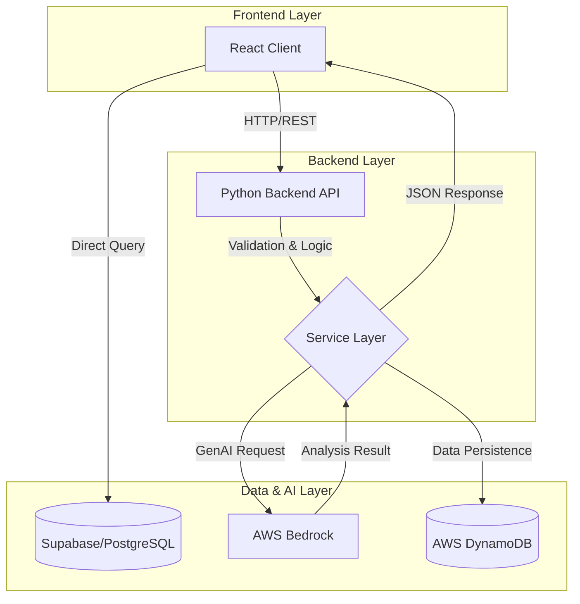

# Accenture Assessment Simulator

[](https://www.harrytheblaze.site/)
[](https://reactjs.org/)
[](https://www.typescriptlang.org/)
[](https://www.python.org/)
[](https://aws.amazon.com/)


## 🚀 About The Project

**Accenture Assessment Simulator** is a full-stack educational platform designed to help students prepare for high-pressure recruitment assessments. Unlike standard quiz apps, this project focuses on **psychological conditioning** by replicating the exact UI/UX, time constraints, and cognitive load of real-world enterprise assessments.

I built this project to demonstrate **end-to-end full-stack engineering skills**, combining a high-performance React frontend with a robust Python/AWS backend to deliver a seamless, low-latency user experience.

## ✨ Key Features

### 🎨 Advanced Frontend Engineering (React + TypeScript)
-   **Complex State Management**: Implemented custom hooks and context providers to manage global assessment state, timers, and user progress across multiple rounds without prop drilling.
-   **Real-time Performance**: Utilized `requestAnimationFrame` for smooth, 60fps animations in the "Balloon Math" cognitive game, ensuring precise hit-testing and physics interactions.
-   **Graph Algorithms for UI**: Applied Depth-First Search (DFS) algorithms in the "Matrix Flow" game to validate complex pathfinding logic directly in the browser.
-   **Responsive & Accessible**: Built with **Tailwind CSS** and **Shadcn UI** to ensure a pixel-perfect, accessible experience across devices.

### ⚙️ Backend & Cloud Architecture (Python + AWS)
-   **Scalable API**: Developed a RESTful API using **Python** (FastAPI/Flask equivalent logic) to handle assessment data and user sessions.
-   **AI Integration**: Integrated **AWS Bedrock** to power the "Communication Round," using LLMs to analyze user inputs and provide intelligent feedback.
-   **Database Design**: Structured data models to efficiently store complex hierarchical data for assessment questions, results, and analytics.

## 🏗️ System Architecture

High-level data flow demonstrating the integration between the Client, API, and External Services.



## 🧠 Engineering Decisions & Trade-offs

### State Management: React Context vs. Redux
**Decision**: Utilized React Context + Custom Hooks.
-   **Why**: For this specific application complexity, Redux would introduce unnecessary boilerplate. Context API provides sufficient global state handling for user sessions and assessment progress without the overhead of a flux pattern library, reducing bundle size and maintenance cost.

### Performance: The "Balloon Math" Game Loop
**Decision**: `requestAnimationFrame` over `setInterval`.
-   **Why**: To ensure a buttery-smooth 60fps experience on varying hardware, `requestAnimationFrame` allows the browser to optimize reflows and repaints. This aligns physics calculations with the display refresh rate, preventing the "jitter" often seen with `setInterval` based loops.

### Latency Optimization: AI Feedback
**Decision**: Asynchronous Processing for Bedrock Calls.
-   **Why**: Generative AI calls can be latent. We architected the "Communication Round" to handle the user's speech-to-text input effectively, providing immediate UI feedback ("Processing...") while the Python backend manages the rigorous handshake with AWS Bedrock, preventing UI freezes.

## 📂 Project Structure

A hybrid monorepo approach for clear separation of concerns.

```bash
accenture-mono-canvas/
├── src/                  # Frontend Application (React)
│   ├── components/       # Reusable UI Components (Shadcn)
│   ├── pages/            # Feature Pages (Assessment Rounds)
│   ├── hooks/            # Custom Logic & State Management
│   └── lib/              # Utilities & Helpers
├── backend/              # Backend Logic (Python)
│   ├── communication-backend/  # Dedicated Service for GenAI
│   └── main.py           # API Entry Point
├── supabase/             # Database Migrations & Types
└── public/               # Static Assets
```


## 🛠️ Tech Stack

| Category | Technologies |
|----------|--------------|
| **Frontend** | React 18, TypeScript, Tailwind CSS, Shadcn UI, Vite, Framer Motion |
| **Backend** | Python, AWS Bedrock (GenAI), RESTful APIs |
| **Database** | Supabase / DynamoDB |
| **DevOps & Tools** | Git, Vercel, npm, ESLint |

## 🏁 Getting Started

Follow these instructions to set up the project locally.

### Prerequisites
-   Node.js (v18+)
-   Python (v3.9+)

### Frontend Setup
```bash
# 1. Clone the repository
git clone https://github.com/yourusername/accenture-mono-canvas.git

# 2. Install dependencies
npm install

# 3. Start the development server
npm run dev
```

### Backend Setup
```bash
# 1. Navigate to backend directory
cd communication-backend

# 2. Install Python dependencies
pip install -r requirements.txt

# 3. Start the server
python3 main.py
```

## 🔮 Future Improvements

-   **Real-time Analytics Dashboard**: Implementing WebSockets for live proctoring features.
-   **Multi-tenant Support**: Refactoring for SaaS capabilities to allow multiple organizations to host their own assessments.
-   **Enhanced AI Models**: Fine-tuning Bedrock models for more specific feedback personalities.

## 📬 Contact

**Hari Krishna** - Full Stack Developer

[](https://www.harrytheblaze.site/)
[](https://www.linkedin.com/in/hari-krishna-aaaa8425b/)

---
*Built with ❤️ to help students succeed.*
